# 📸 Attendance Management System with Face Recognition  

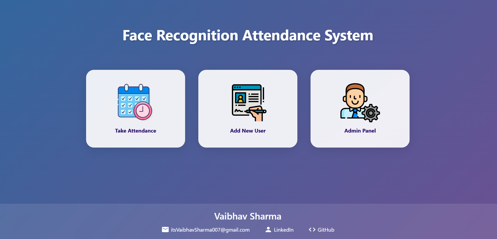

---

## 🗂️ Table of Contents  
1. [Overview](#overview)  
2. [Features](#features)  
   - [User Management](#user-management)  
   - [Attendance Management](#attendance-management)  
3. [Technologies Used](#technologies-used)  
4. [How It Works](#how-it-works)  
5. [Screenshots](#screenshots)  
6. [Installation and Setup](#installation-and-setup)  
7. [Future Enhancements](#future-enhancements)  
8. [Developer Info](#developer-info)  
9. [License](#license)  

---

## 📖 Overview  
This is a web-based **Attendance Management System** that leverages **Face Recognition** to streamline attendance tracking. The system uses **machine learning**, CSV data storage, and **OpenCV** to provide an intuitive, efficient, and secure solution for managing attendance records.  

- **Developed During**: AICTE Internship Program on Artificial Intelligence (AI: Transformative Learning with TechSaksham)  
- **Internship Program**: TechSaksham (by Microsoft & SAP)  

    AICTE Student ID: STU671cb247eeda01729933895

    AICTE Internship ID: INTERNSHIP_172777276266fbb85a28f94
- **Duration**: 13th November 2024 – 30th December 2024

---

## ✨ Features  

### 👤 User Management  
- **Add User**:  
  - Add users with their name and ID.  
  - The system captures **10 pictures** for facial recognition.  
  - Newly added users are unregistered by default.  

- **Register User**:  
  - Admin assigns a section to users for registration.  

- **Unregister/Remove User**:  
  - Admin can unregister or delete users from the system.  

---

### ✅ Attendance Management  
- **Mark Attendance**:  
  - Uses face recognition to mark attendance securely.  

- **View Attendance**:  
  - Admin can filter attendance by **date** or **user ID**.  

---

## 🛠️ Technologies Used  

### Programming Languages and Libraries  
- **Python**  
  - `Flask` - Backend web framework.  
  - `OpenCV` (`cv2`) - For image processing and face recognition.  
  - `numpy` - Numerical computations.  
  - `pandas` - Data manipulation.  
  - `joblib` - For model serialization.  
  - `csv` - CSV data handling.  

### Machine Learning  
- **scikit-learn**:  
  - **K-Nearest Neighbors (KNN)** algorithm for face recognition.  

---

## ⚙️ How It Works  

1. **Add User**:  
   - Enter the user's name and ID.  
   - The system captures 10 images and stores them for training.  

2. **Register User**:  
   - Admin assigns the user to a section.  

3. **Mark Attendance**:  
   - The user stands in front of the webcam.  
   - Face recognition is performed, and attendance is logged (only once an hour).  

4. **View Attendance**:  
   - Admin can filter attendance records by date or user ID.  

---

## 🖼️ Screenshots   

### 1. Home Page  
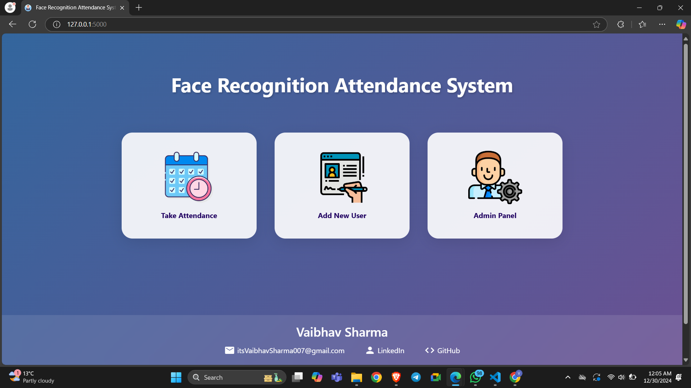  

### 2. Add User 1
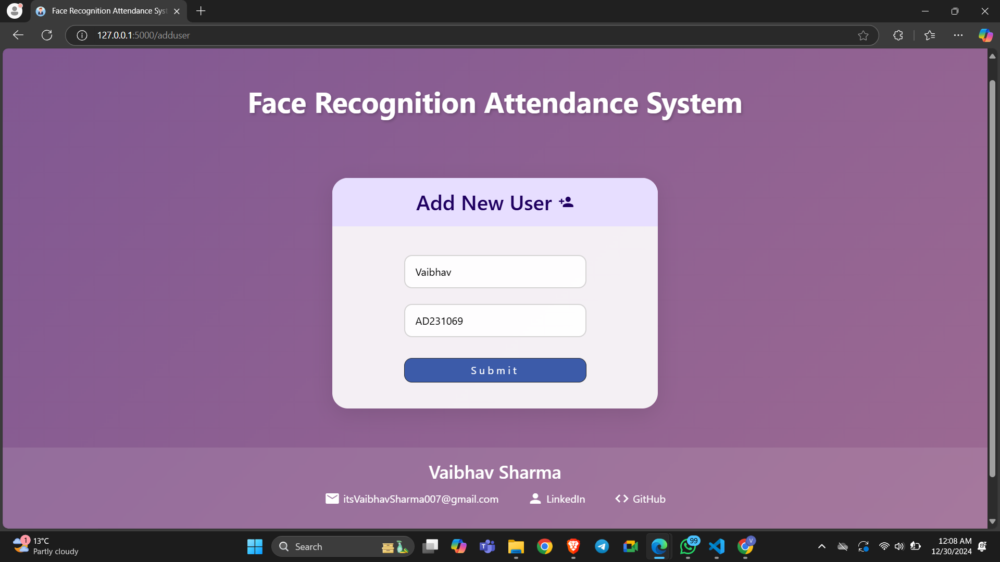  

### 3. Add User 2
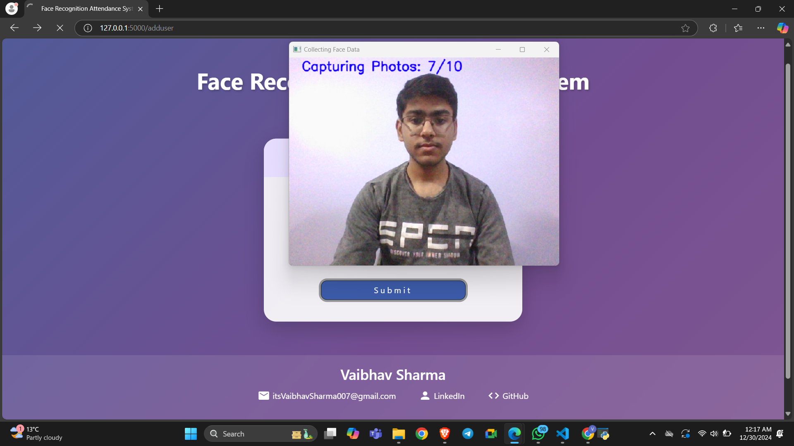  

### 4. Add User 3
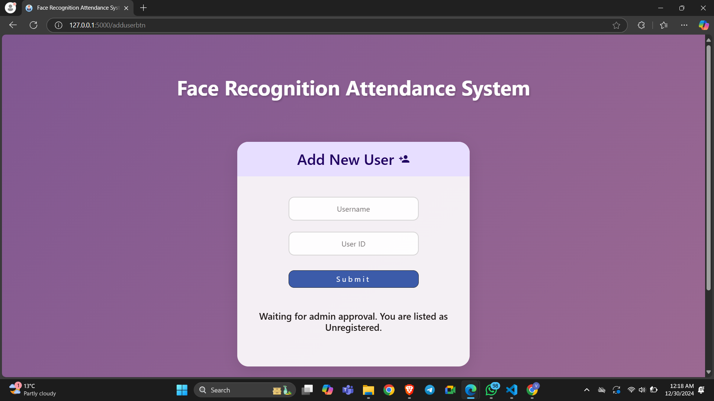  

### 5. Login Page  
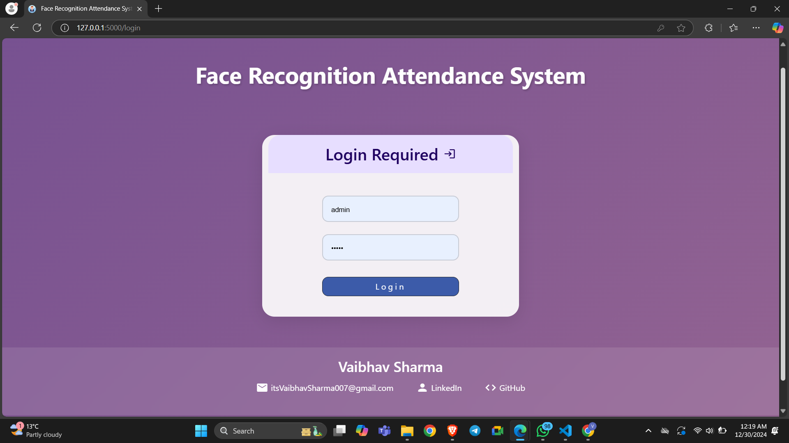  

### 6. Admin Dashboard  
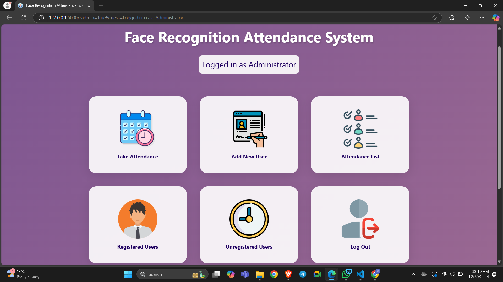  

### 7. Unregistered Users  
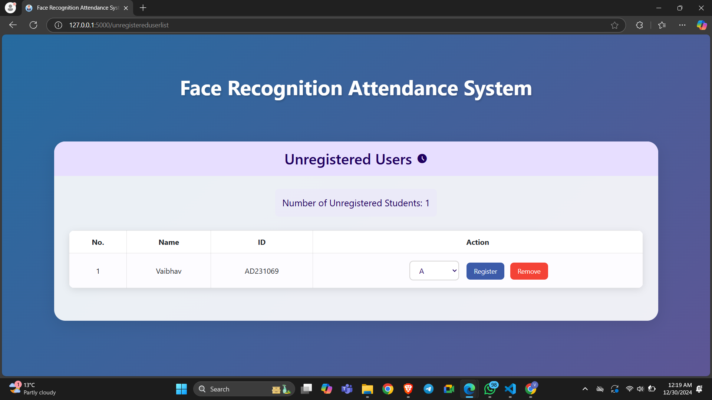  

### 8. Registered Users  
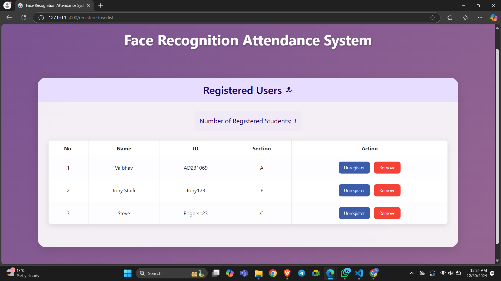  

### 9. Attendance Page - 1  
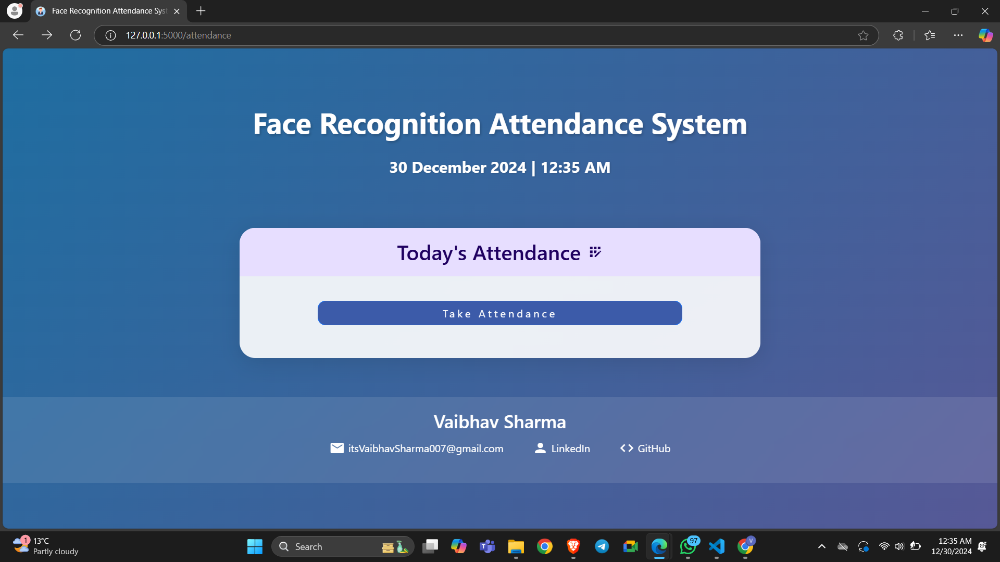  

### 10. Attendance Page - 2
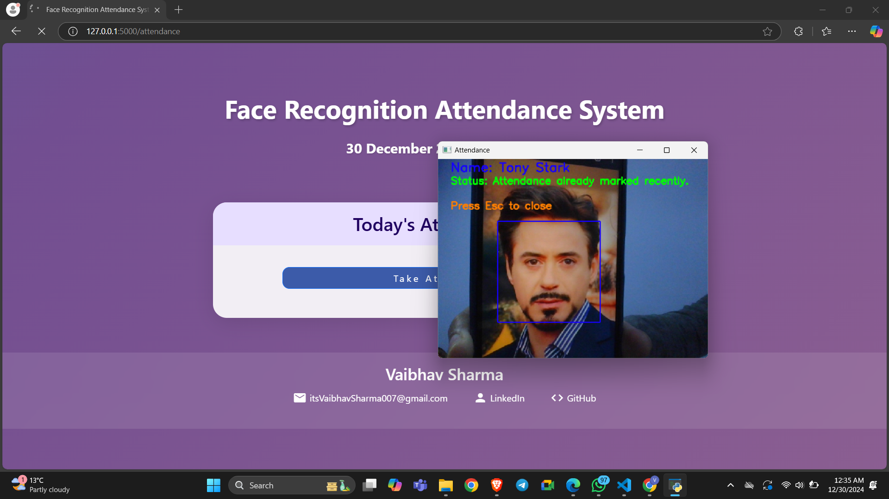  

### 11. Attendance Page - 3
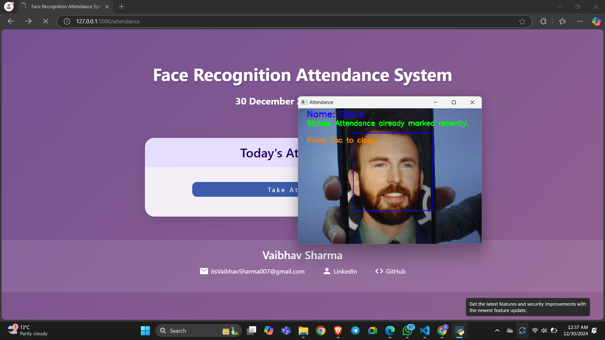  

### 12. Attendance Page - 4
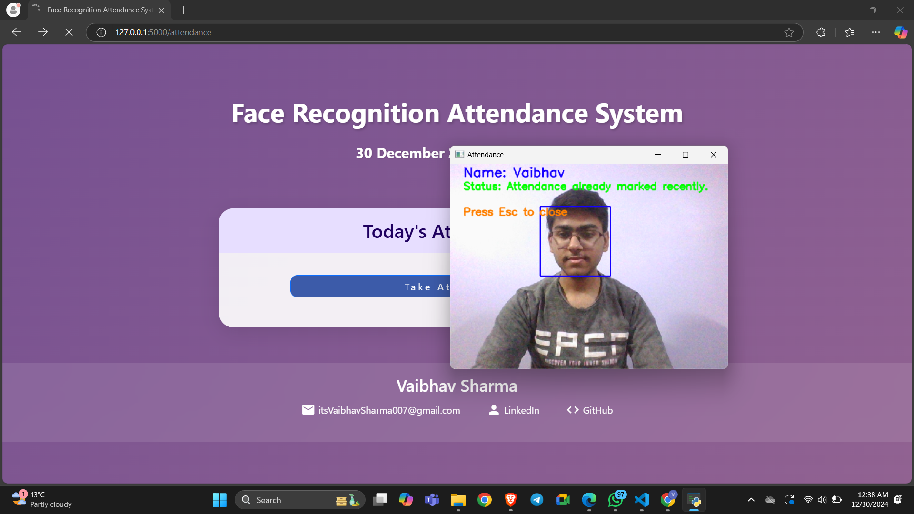  

### 13. Attendance Page - 5
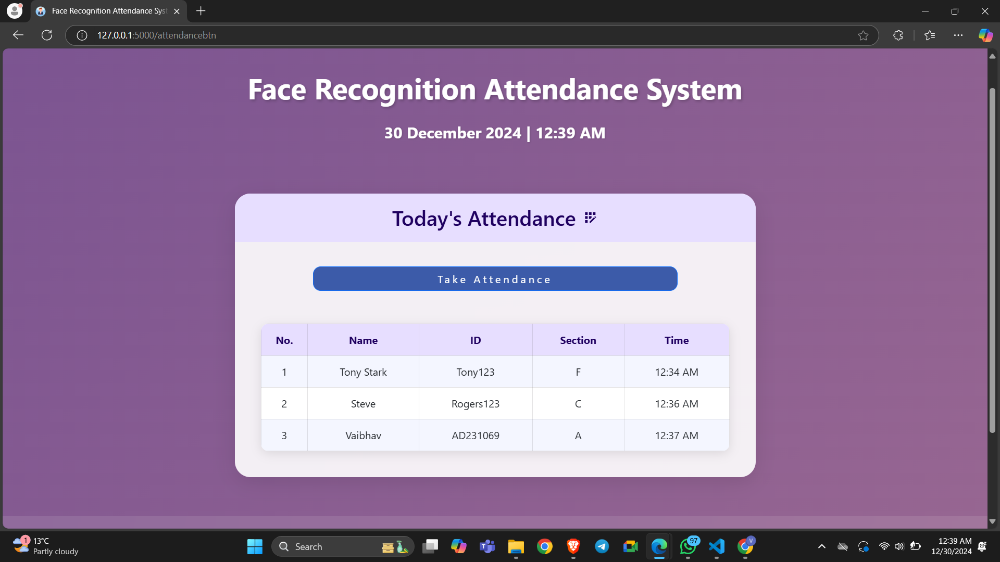  

### 14. Attendance List - 1
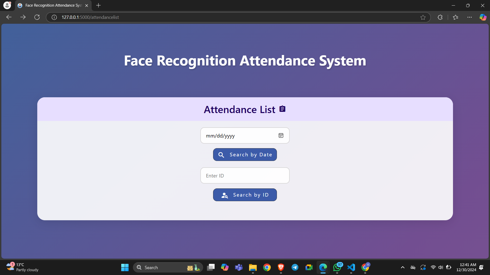  

### 15. Attendance List - 2
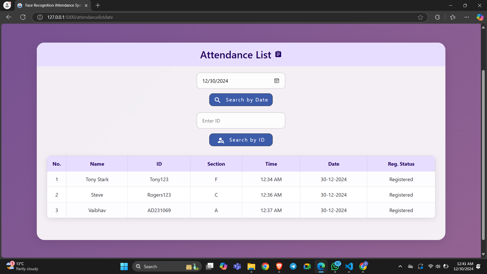  

### 16. Attendance List - 3
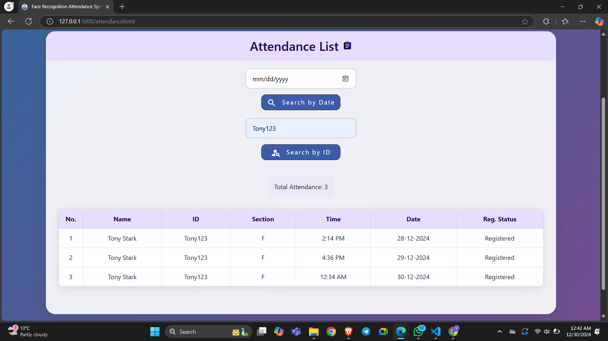  


---

## 🛠️ Installation and Setup  

1. **Clone the repository**:  
   ```bash
   git clone https://github.com/itsVaibhavSharma/face-recognition-attendance-system.git
   cd attendance-management-system
   ```

2. **Create a virtual environment**:  
   ```bash
   python -m venv venv
   source venv/bin/activate  # On Windows: venv\Scripts\activate
   ```

3. **Install dependencies**:  
   ```bash
   pip install -r requirements.txt
   ```

4. **Run the Flask application**:  
   ```bash
   flask run
   ```

5. **Access the application**:  
   - Open your browser and navigate to `http://127.0.0.1:5000`.  

   ```json
   Admin Details
   username: admin
   password: 12345
   ```

---

## 🚀 Future Enhancements  

- Integration with biometric devices.  
- Advanced analytics for attendance trends.  
- Mobile app integration.  
- Role-based user authentication.  

---

## 👨‍💻 Developer Info  

<table style="width:100%; text-align:center; background-color:#f9f9f9; padding:20px;">
  <!-- First row with profile image -->
  <tr align="center">
    <td align="center">
      <br>
      <strong>Vaibhav Sharma</strong><br>
      Full Stack Developer<br>
      <a href="https://www.linkedin.com/in/itsvaibhavsharma/" target="_blank">
        
      </a>
      <a href="https://github.com/itsVaibhavSharma" target="_blank">
        
      </a>
      <a href="mailto:itsVaibhavSharma007@gmail.com" target="_blank">
        
      </a>
    </td>
  </tr>
  <!-- Second row with name and contact info -->
  
</table>


---

## 📜 License  

This project is licensed under the **MIT License**.  

---

## 🛡️ Acknowledgments  

This project was created during the **TechSaksham AI Internship Program**, a collaborative effort by **Microsoft**, **SAP**, and **AICTE**. Special thanks to the mentors for their guidance and support.  


